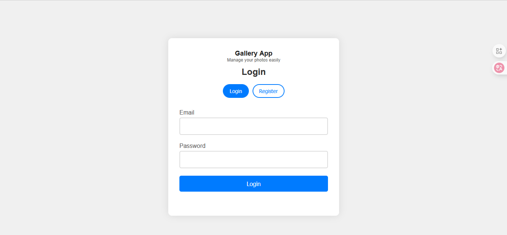
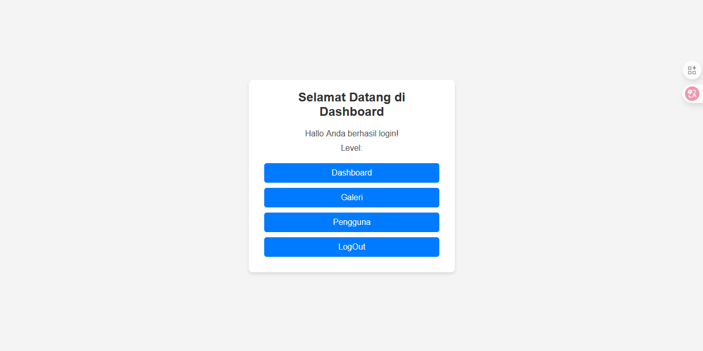
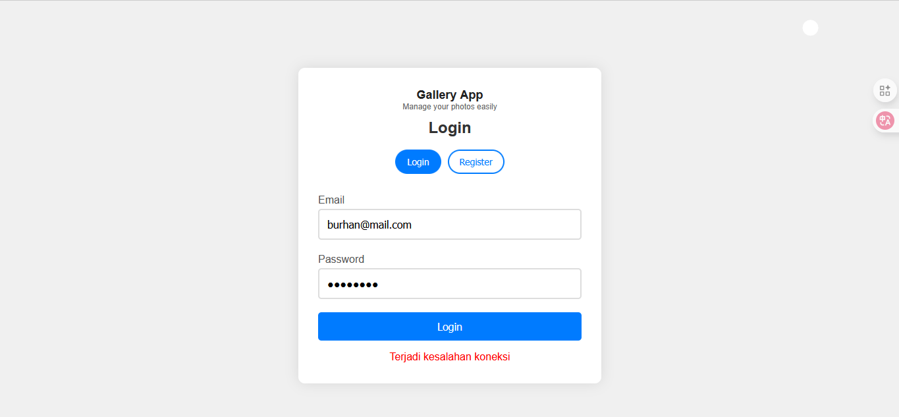
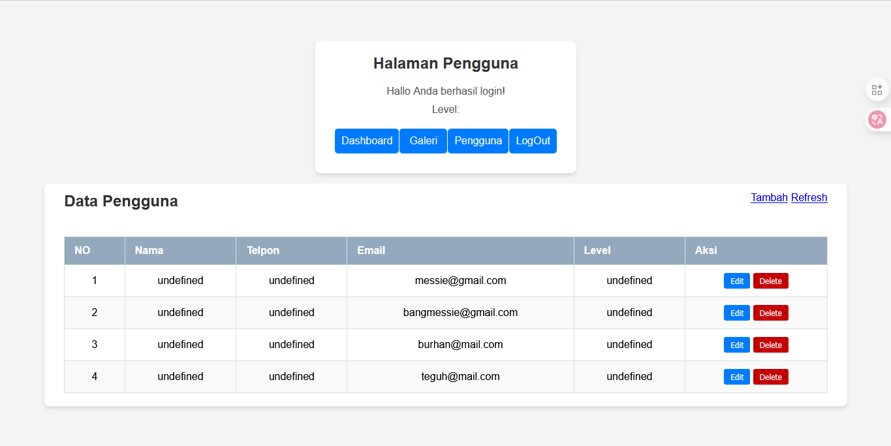

ini adalah frontend gallery dari website saya yang mana saya buat untuk mengakomodasi backend yang sudah di buat sebelumnya.

---

---

> kita masih memproses login dan register dengan benar kurang untuk memproses menampilkan data users, dan galeri dengan benar. itu pr kita sekarang.

---

---

> dan kita menemukan masalah baru dimana ? did users terdapat colom yang kosong dimana di situ ada yang namanya level dan telephone itu seharusnya ada tapi di punya kita tidak ada jadi kalau yang mau menambahkan monggo di tambahkan di situ.

